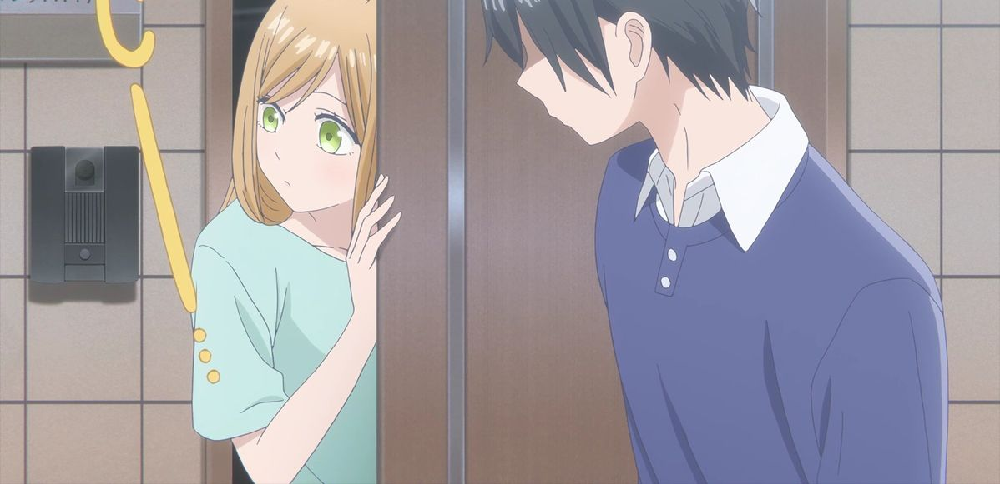

<h1 align="center">💗 coding is a life 💗</h1>

  ✧･ﾟ: *✧･ﾟ: * 💖 💫 💖 *:･ﾟ✧*:･ﾟ✧

<!-- Imágenes lado a lado con bordes -->

  

  
  

  ✧･ﾟ: *✧･ﾟ: * 💖 💫 💖 *:･ﾟ✧*:･ﾟ✧

<!-- Calendario rosita de contribuciones -->
<h2 align="center">📅 Contribuciones::</h2>

  

  ✧･ﾟ: *✧･ﾟ: * 💖 💫 💖 *:･ﾟ✧*:･ﾟ✧

<h2 align="center" style="font-family: Poppins, sans-serif;">🌸 Gustos: 🌸</h2>

📚 reading | 🎌 anime | 🎮 cozy games | 💄 makeup | 🧴 skincare

  ✧･ﾟ: *✧･ﾟ: * 💖 💫 💖 *:･ﾟ✧*:･ﾟ✧

<h2 align="center" style="font-family: Poppins, sans-serif;">💻 Languages 💻</h2>

  
  

  ✦ 𓆩♡𓆪 ✦ 𓆩♡𓆪 ✦ 𓆩♡𓆪 ✦

  ✧･ﾟ: *✧･ﾟ: * 💖 💫 💖 *:･ﾟ✧*:･ﾟ✧

